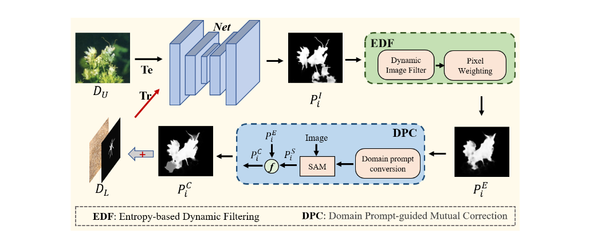
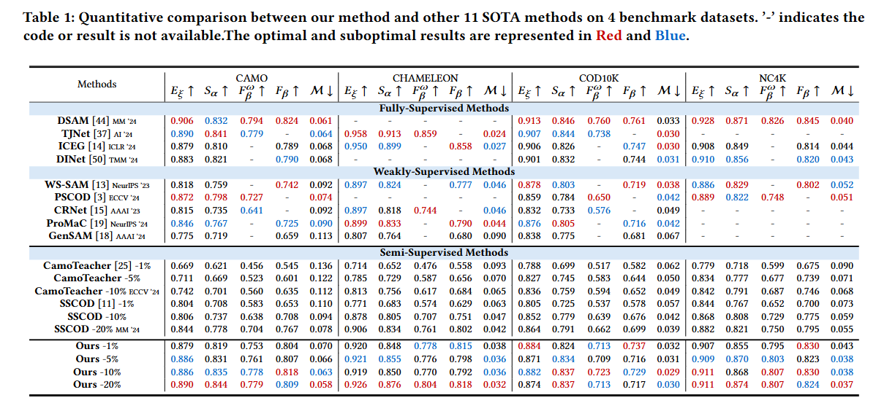
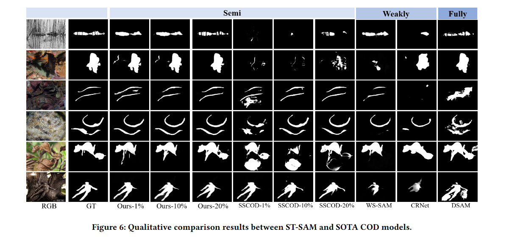
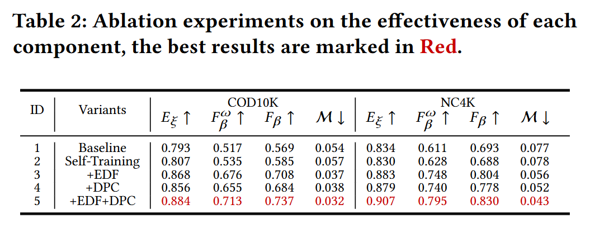
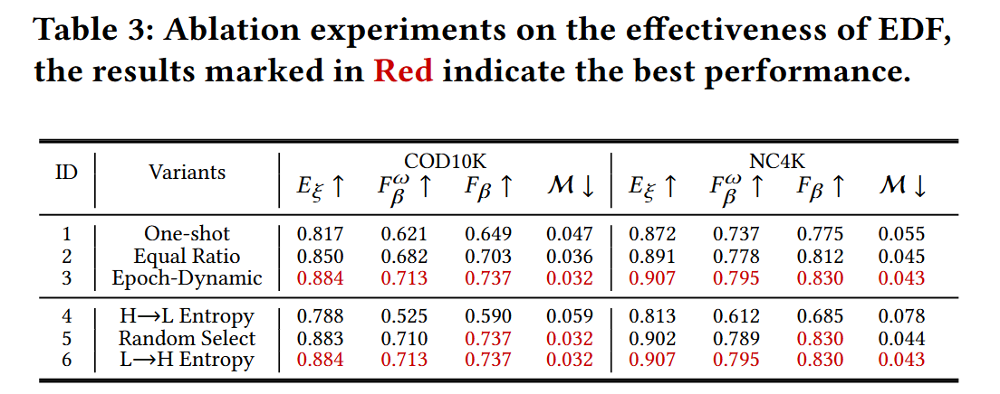
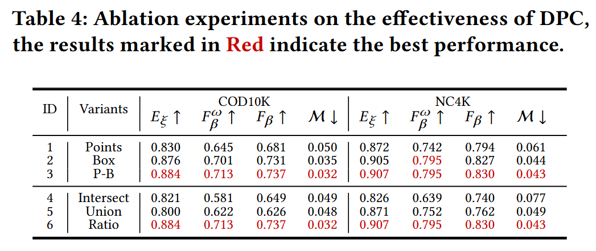
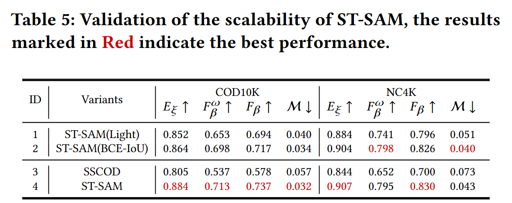

# 论文阅读 
## ST-SAM: SAM-Driven Self-Training Framework for Semi-Supervised Camouflaged Object Detection

Semi-Supervised Camouflaged Object Detection（SSCOD）：半监督伪装目标检测

[Segment Anything Model（SAM）：分割一切大模型](https://blog.csdn.net/qq_36104364/article/details/133101952)

### 一些概念

1. 师生（Teacher-Student）框架：深度学习中的一种经典模型架构，其核心思想是通过让一个较小、较简单的模型（学生模型）向一个较大、较复杂且性能优异的模型（教师模型）学习，来实现模型压缩和性能提升等目的。

2. 伪装特定数据（camouflage-specific data）：其所有特征都围绕 “支撑伪装系统实现‘目标 - 环境特征匹配’” 展开，本质是 “为伪装设计、优化、评估提供量化依据”，最终目标是降低目标在特定探测手段下的 “可探测性”。无论是军事、安防（如反恐伪装）还是民用（如野生动物保护中的隐蔽观测设备伪装）领域，数据特征均需贴合具体场景的 “环境属性” 与 “探测威胁”。

3. 局部前景概率（the local foreground probability）：在处理图像或视频数据时，算法需要区分 “前景” 和 “背景”。

    前景（Foreground）：指图像中需要重点关注、分析的目标（如行人、车辆、物体等）；

    背景（Background）：指图像中衬托前景的环境区域（如路面、天空、墙壁等）；

    局部（Local）：强调以图像的 “局部区域”（而非全局）为分析单位，通常是单个像素、像素块或小窗口；

    概率（Probability）：用 0~1 之间的数值表示 “某局部区域属于前景的可能性”—— 数值越接近 1，该区域是前景的概率越高；越接近 0，则更可能是背景。

### 模型

现有的基于师生框架的SSCOD方法在监督信息稀缺的情况下存在严重的预测偏差和误差传播问题，且其多网络架构会导致较高的计算开销和有限的可扩展性，本文设计的ST-SAM框架，采用自训练策略，根本上规避了模型间的预测偏差。此外，本文的设计还利用SAM在特定任务中的潜力，以减轻自训练的误差累积。

简单来说，本文在自训练框架（self-training）的基础上，设计了EDF和DPC两个模块，利用SAM强大的能力，增强了伪标签的可信度。

#### 基本结构：

1. **熵基动态过滤（Entropy-based Dynamic Filtering strategy，EDF）**
    
    EDF 模块通过局部熵计算、全局熵评估、不确定性筛选、像素加权、动态扩展五个关键步骤，完成对初始伪标签的清洗与优化，具体流程如下：
    
    **（1）输入：初始伪标签的生成**
    
    首先，用少量标注数据（如 1%）预训练基础 COD（伪装目标检测）网络，再用该网络对无标签数据（$D_U$）进行预测，生成初始伪标签$P_i^I$（$i$表示第$i$个无标签样本）。此时$P_i^I$因模型能力有限，包含大量噪声（如背景误判为目标、目标轮廓不完整）。

     
    
    **（2）步骤 1：计算局部与全局熵（量化不确定性）**
    
    熵（Entropy）是衡量概率分布不确定性的指标：熵值越高，预测结果越模糊（如像素既像目标又像背景）；熵值越低，预测越确定。EDF 通过 “局部熵（$E_{local}$） + 全局熵（$E_{global}$）” 双重维度评估伪标签的可靠性：
    
        局部熵：评估像素级不确定性
        全局熵：评估实例级不确定性
    
    对初始伪标签$P_i^I$的每个像素，用7×7 窗口计算局部前景概率，再推导局部熵，量化该像素邻域的预测模糊度：
    
    先对$P_i^I$进行归一化（Norm），再通过均值滤波（UF）得到每个像素的局部前景概率$p_f$，背景概率$p_b=1-p_f$：

    $$p_f = UF\left(Norm\left(P_i^I\right), 7×7\right)$$
    
    基于$p_f$和$p_b$，用信息熵公式计算每个像素的局部熵，熵值越高表示该区域预测越不确定：

    $$E_{local} = -p_f \log(p_f) - p_b \log(p_b)$$

    对整个伪标签$P_i^I$计算全局前景概率$\tilde{p}_f$（所有像素归一化后的均值），再推导全局熵，量化整个样本的预测可信度：

    $$\tilde{p}_f = \frac{1}{H×W} \sum Norm(P_i^I)$$
    $$E_{global} = -\tilde{p}_f \log(\tilde{p}_f) - (1-\tilde{p}_f) \log(1-\tilde{p}_f)$$

    （$H×W$为伪标签的像素尺寸）
    
     

    **（3）步骤 2：实例级筛选（剔除高噪声样本）**
    
    基于局部熵与全局熵，定义不确定性指标$u_\alpha$，筛选出可靠的伪标签样本：

    不确定性指标计算：统计 “局部熵> 0.5× 全局熵” 的像素占比（$N$为总像素数，$\mathbb{I}(·)$为指示函数），占比越高表示样本噪声越多：

    $$u_\alpha = \frac{1}{N} \sum \mathbb{I}\left(E_{local} > E_{global} × 0.5\right)$$

    样本保留规则：设定阈值$\tau_\alpha=0.3$，仅保留$u_\alpha < \tau_\alpha$的样本，直接剔除噪声严重的样本，避免早期训练引入大量误差：

    $$\text{Retain Sample If } u_\alpha < 0.3, \text{ Else Discard}$$

     

    **（4）步骤 3：像素级加权（抑制局部模糊区域）**

    对筛选后的样本，基于局部熵生成熵权重图，对不同可信度的像素分配不同权重，降低不确定区域对模型训练的干扰，最终得到熵加权伪标签$P_i^E$：

    $$P_i^E = P_i^I \cdot \left(0.5 + 0.5×(1-E_{local})^k\right)$$

    权重系数设计：$k=1$（实验验证的最优值），局部熵$E_{local}$越低，权重越接近 1（可信区域充分贡献）；$E_{local}$越高，权重越接近 0.5（模糊区域贡献减半）。
     
    **（5）动态扩展（适配模型渐进式学习）**

    考虑到模型训练初期能力有限，无法处理复杂样本，EDF 采用随 epoch 动态扩展的策略，逐步增加伪标签的规模，实现 “从易到难” 的学习：

    一、计算所有熵加权伪标签$P_i^E$的局部熵均值$\bar{E}_{local}$，按均值从小到大排序（均值越小表示样本越简单、可信）；

    二、初始训练阶段，仅选择排序靠前的少量低熵样本（如当前训练集规模$x$的等量样本）加入训练集；

    三、随 epoch 增加，逐步扩大选择范围，纳入更多熵值稍高的样本（即更复杂的样本），直至所有无标签样本被充分利用。

     
     

2. **领域提示引导互校正（Domain Prompt-guided Mutual Correction strategy，DPC）**

    作用：注入领域知识到 SAM，生成高质量伪标签，与模型伪标签互校正。

    DPC模块的核心目标是**解决SAM在伪装目标检测（COD）中的领域适配缺陷**——SAM虽经通用数据预训练具备强分割能力，但缺乏COD领域先验（如伪装目标与背景纹理高度相似、轮廓复杂），直接应用易误判；同时，自训练初期EDF模块输出的熵加权伪标签（$P_i^E$）仍存在边界模糊、小目标漏检等问题。DPC通过“领域提示转化+伪标签互校正”，既为SAM注入COD知识，又修正伪标签噪声，生成高置信监督信号。

    DPC模块以EDF输出的**熵加权伪标签$P_i^E$** 为输入，通过三步完成领域知识注入与伪标签优化：
     
    **（1）步骤1：生成混合提示（注入COD领域知识）**
    
    将$P_i^E$转化为SAM可理解的“点+框”混合提示（$Prompt_{P-B}$），核心是注入COD领域三大先验知识：

    - **框提示（$Prompt_B$）：确保目标区域完整性**  
    
        过滤$P_i^E$中极小轮廓区域（排除噪声），保留有效目标轮廓$Mask_i$（$i=1,...,n$）；  
        
        提取每个$Mask_i$的最小外接矩形，坐标表示为$[x_{min}, y_{min}, x_{max}, y_{max}]$，公式如下：  
        
        $$ 
        Prompt_B = Mask_i\left[x_{min}, y_{min}, x_{max}, y_{max}\right]
        $$  
        
        该提示告诉SAM：“COD场景中伪装目标需完整覆盖，避免因局部相似遗漏目标区域”。

    - **点提示（$Prompt_P$）：精准定位目标中心**  

        计算每个$Mask_i$的几何中心点$c_i(x_i,y_i)$，验证是否在$Mask_i$内部； 

        若$c_i$在外部，通过轴向搜索（$AxialS(·)$）沿$Mask_i$长轴方向找到最近内部点$c_i'$；  
        
        最终点提示集为：  
        $$
        Prompt_P = \left\{c_i, IsInside(c_i)=1\right\} \bigcup \left\{c_i', IsInside(c_i)=0\right\}
        $$  
        
        该提示告诉SAM：“COD场景中需以目标核心为锚点，避免被背景纹理干扰定位”。

    - **混合提示融合**：将$Prompt_B$与$Prompt_P$结合为$Prompt_{P-B}$，同时注入“区域完整性”与“中心定位”知识，适配COD复杂场景。
     

    **（2）步骤2：SAM引导分割（生成$P_i^S$）**
    将混合提示（$Prompt_{P-B}$）与无标签图像输入SAM，利用SAM的强分割能力生成**SAM伪标签$P_i^S$**，公式如下：  
    $$
    P_i^S = SAM\left(Image, Prompt_{P-B}\right)
    $$  
    此时$P_i^S$因融入COD领域知识，相比直接使用SAM的输出，在伪装目标边界完整性、小目标检出率上显著提升。

    步骤3：伪标签互校正（生成$P_i^C$）
    
    将$P_i^E$与$P_i^S$**等比例融合**，相互修正误差：
    
    - $P_i^E$：虽经EDF过滤，但可能存在局部边界模糊；  
    
    - $P_i^S$：虽分割精度高，但可能因提示偏差导致部分区域误判；  
    
    - 融合后生成高置信伪标签$P_i^C$，公式如下：  
    
    $$
    P_i^C = fuse\left(P_i^E, P_i^S\right)
    $$  

     
     

3. **COD 网络和损失函数**

    ST-SAM 框架的核心优势之一是模型灵活性 —— COD 网络并非固定架构，可根据任务需求替换，文中实验采用基于经典 U-Net 改进的编码器 - 解码器结构（源自 Zhang 等人 2024 年的研究），该结构专为伪装目标检测设计，重点强化了多尺度特征融合与细节捕捉能力。

    文中设计混合损失函数$\mathcal{L}_{total}$，公式定义为：

    $$
    \mathcal{L}_{total} = \mathcal{L}_s + \alpha · \mathcal{L}_{dice} + \beta · \mathcal{L}_{UAL}
    $$

    其中，$\alpha$=4、$\beta$=2为权重系数，用于平衡不同损失组件的贡献。

    $\mathcal{L}_s$由加权二元交叉熵（wbce）与交并比损失（wiou）加权组成。

    $\mathcal{L}_{dice}$是基于 Dice 系数的改进版本，引入平滑项S（通常取 1e-6）避免分母为 0，公式为：

    $$
    \mathcal{L}_{dice} = 1 - \frac{2 · \sum{(Pred^p · Target^p)} + S}{\sum{Pred^p} + \sum{Target^p} + S}
    $$

    $\mathcal{L}_{UAL}$是基于交叉熵的变体，引入动态权重系数$λ_{ual}$（随学习率衰减而减小），公式为：

    $$
    \mathcal{L}_{UAL} = λ_{ual} · \sum{(Pred · log(Pred) + (1 - Pred) · log(1 - Pred))}
    $$

     
     

### 实验

#### 对比实验

    
#### 消融实验

**模块的有效性：**

    （1）baseline：只用少量有标签样本集 $D_L$
    （2）self-training: 经典的自训练策略，伪标签通过COD网络从无标签样本$D_U$获得，以直接扩展$D_L$
    （3）只加入EDF
    （4）只加入DPC
    （5）EDF+DPC
    

**关于EDF的有效性：**

EDF的动态扩展策略的有效性：

    （1）一次性扩展所有合格样本
    （2）每一步按同等比例（20%）扩展样本进行学习
    （3）随着训练轮次动态扩展

关于样本学习顺序：

    （1）先学习高熵样本
    （2）随机选择
    （3）先学习低熵样本
    

**关于DPC的有效性：**
    
关于不同提示策略：

    （1）多点提示
    （2）单框提示
    （3）混合提示

关于融合方法：

    （1）取交集
    （2）取并集
    （3）等比例融合

**关于ST-SAM的可扩展性:**

（1）用PRNet替代COD网络，PRNet是一种为全监督COD设计的轻量级网络。
（2）用BCE-IoU替代损失函数。

