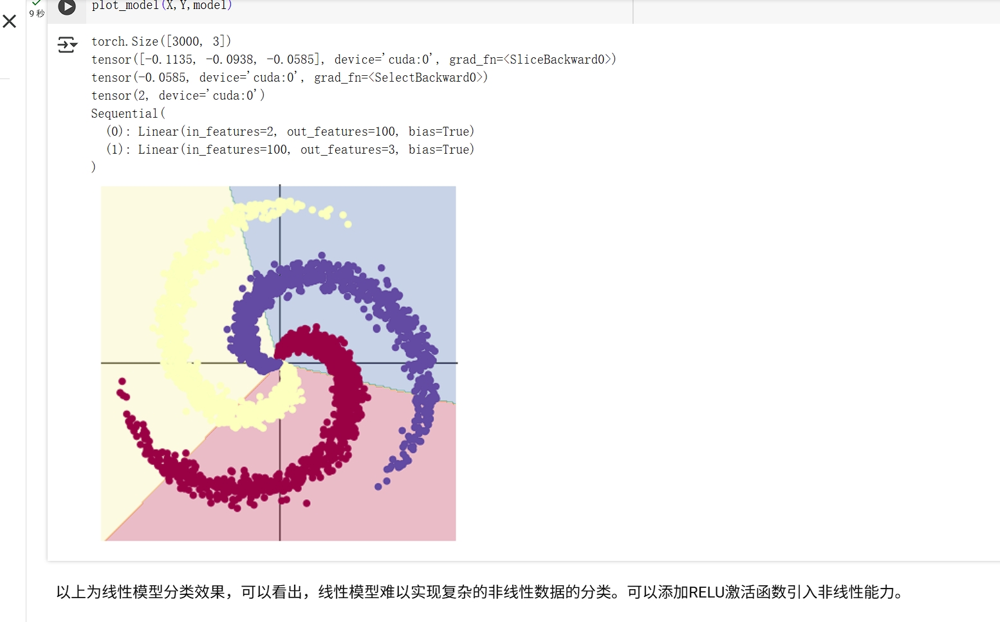
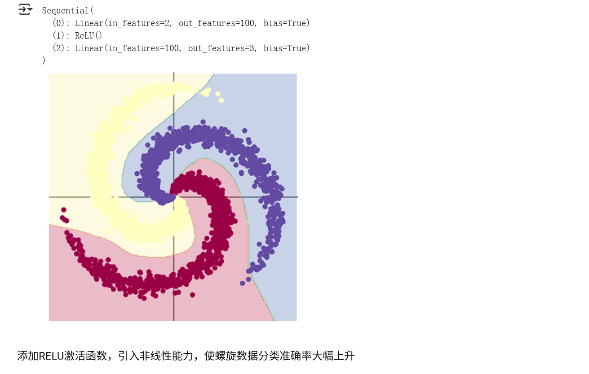

## 第一部分：代码练习
在colab上实现螺旋数据分类。[colab链接](https://colab.research.google.com/drive/1_As8tL9jVyNeyYkmgJy5tK-57GetkXNf?usp=sharing)

## 第二部分：问题总结

### 1、AlexNet有哪些特点？为什么可以⽐LeNet取得更好的性能？

AlexNet特点 ([参考文章](https://blog.csdn.net/Louie_0/article/details/114291419)) ：

    ·更深的网络结构（LeNet只有两层卷积，而AlexNet有5层卷积层）

    ·使用层叠的卷积层，即卷积层+卷积层+池化层来提取图像的特征

    ·使用数据增强Data Augmentation和Dropout抑制过拟合

    ·使用RELU作为激活函数（LeNet使用sigmoid作为激活函数，RELU比起sigmoid，有更高的计算效率，深层网络反向传播更稳定）

    ·多GPU训练（LeNet使用GPU训练）

以上优势使其可以比LeNet取得更好性能。

### 2、激活函数有哪些作⽤？

激活函数提供了神经网络非线性建模的能力。如果没有激活函数，神经网络每层的输入只是上一层输出的线性函数。

### 3、梯度消失现象是什么？

反向传播算法利用损失函数的导数（即梯度）来更新参数，根据链式法则，如果参数值小于1，则网络越深，其求导后的结果的权值连乘次数越多，就会导致梯度越来越趋近于0，这就是梯度消失现象。

### 4、神经⽹络是更宽好还是更深好？

神经网络的宽度与深度需要根据具体任务抉择，并不是网络越深越好或越宽越好，网络越深，其特征表达能力越强，但其可能会导致梯度消失或梯度爆炸，使得模型精度反而下降；网络越宽，其泛化能力越强，但也有过拟合的风险。

### 5、为什么要使⽤Softmax?

在多分类任务中，softmax函数保证各个类别的输出概率在[0,1]之间，且所有类别的概率和为1。这保证了模型的输出结果有唯一类别，实现分类的目的。

### 6、SGD 和 Adam 哪个更有效？

在面对高复杂度或缺乏调参经验的任务时，一般优先选择Adam。SGD一般用于快速训练或计算资源受限的任务。