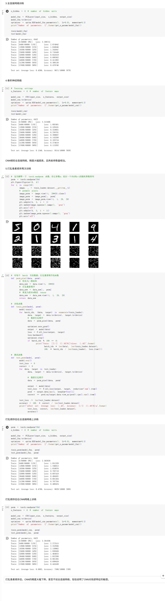
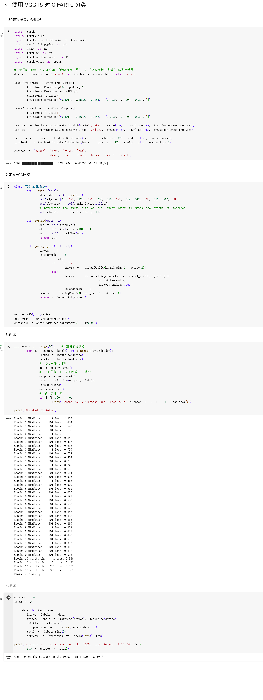

## 第一部分：代码练习
1.MNIST 数据集分类：构建简单的CNN对 mnist 数据集进⾏分类。
[colab链接](https://colab.research.google.com/drive/1_As8tL9jVyNeyYkmgJy5tK-57GetkXNf?usp=sharing)

2.CIFAR10 数据集分类：使⽤ CNN 对 CIFAR10 数据集进⾏分类。
[colab链接](https://colab.research.google.com/drive/13IyPF69qQiBNRIgZ9C4VESE-2QEC2lrh?usp=sharing)

3.使⽤ VGG16 对 CIFAR10 分类。
[colab链接](https://colab.research.google.com/drive/13IyPF69qQiBNRIgZ9C4VESE-2QEC2lrh?usp=sharing)

## 第⼆部分：问题总结

### 1.dataloader ⾥⾯ shuffle 取不同值有什么区别？

### 2.transform ⾥，取了不同值，这个有什么区别？

### 3.epoch 和 batch 的区别？

### 4.1x1的卷积和 FC 有什么区别？主要起什么作⽤？

### 5.residual leanring 为什么能够提升准确率？

### 6.代码练习⼆⾥，⽹络和1989年 Lecun 提出 LeNet 有什么区别？

### 7.代码练习⼆⾥，卷积以后feature map 尺⼨会变⼩，如何应⽤ Residual Learning？

### 8.有什么⽅法可以进⼀步提升准确率？