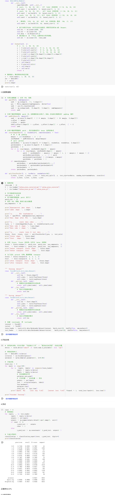

# 第四周 [MobileNet_ShuffleNet](https://gitee.com/gaopursuit/ouc-dl/blob/master/week04.md)

## 第一部分：代码练习

阅读论⽂《HybridSN: Exploring 3-D–2-DCNN Feature Hierarchy for Hyperspectral Image Classification》，思考3D卷积和2D卷积的区别。并阅读HybridSN的代码 ([实验指导链接](https://gitee.com/gaopursuit/ouc-dl/blob/master/lab/week04_HybridSN_GRSL2021.ipynb)) 

把代码敲⼊ Colab 运⾏，⽹络部分需要⾃⼰完成。

[colab链接](https://colab.research.google.com/drive/1rv-ZyDrPRsPTjQQzRT0pNn56KhwpT0Ma?usp=sharing)

编写的代码如下，模型代码在 model.py 中展示。

## 第⼆部分：问题总结

### 1.训练HybridSN，然后多测试⼏次，会发现每次分类的结果都不⼀样，请思考为什么？ 

HybridSN的全连接层间使用了比例为0.4的 Dropout，其在前向传播过程中，会随机丢弃40%的神经元，这会迫使网络不依赖特定神经元组合，增强特征表达的鲁棒性。然而在测试时，如果不采用相应方法，其测试结果会有较大差异。

### 2.如果想要进⼀步提升⾼光谱图像的分类性能，可以如何改进？ 

可以尝试使用其它特征增强的方法，如引入残差连接、注意力机制等。

### 3.depth-wise conv 和 分组卷积有什么区别与联系？ 

区别：深度可分离卷积是空间卷积与通道卷积的序列组合，分组卷积是通道维度的并行分组计算。

联系：当分组卷积的分组数量等于通道数时，其可以等价于深度可分离卷积。两者均减轻了传统卷积的参数量和计算量，且均能提高模型准确率。

### 4.SENet 的注意⼒是不是可以加在空间位置上？ 

SENet的注意力机制‌本质是通道维度的‌，无法直接捕获空间位置重要性。若需空间位置感知，必须结合其他注意力模块。

### 5.在 ShuffleNet 中，通道的 shuffle 如何⽤代码实现？

代码见shuffleNet_channel.py