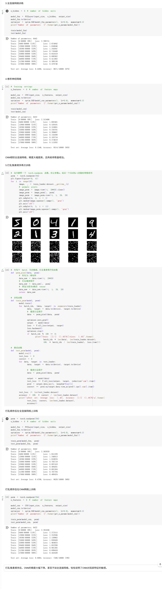
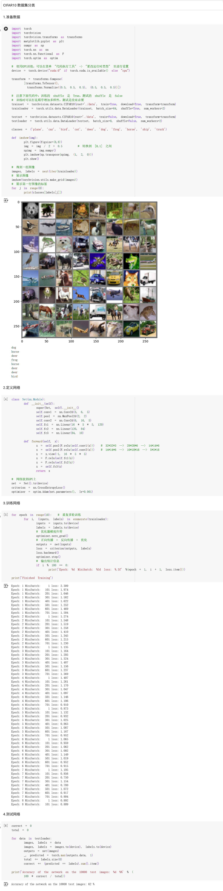
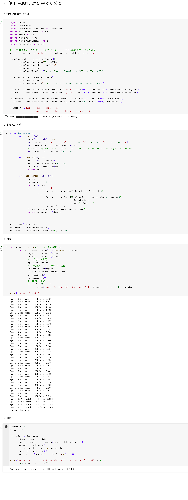

## 第一部分：代码练习
1.MNIST 数据集分类：构建简单的CNN对 mnist 数据集进⾏分类。
[colab链接](https://colab.research.google.com/drive/1_As8tL9jVyNeyYkmgJy5tK-57GetkXNf?usp=sharing)



2.CIFAR10 数据集分类：使⽤ CNN 对 CIFAR10 数据集进⾏分类。
[colab链接](https://colab.research.google.com/drive/13IyPF69qQiBNRIgZ9C4VESE-2QEC2lrh?usp=sharing)



3.使⽤ VGG16 对 CIFAR10 分类。
[colab链接](https://colab.research.google.com/drive/13IyPF69qQiBNRIgZ9C4VESE-2QEC2lrh?usp=sharing)



## 第⼆部分：问题总结

### 1.dataloader ⾥⾯ shuffle 取不同值有什么区别？

shuffle 参数控制数据加载顺序，具体区别如下：

‌shuffle=True‌：

    每个 epoch 开始时随机打乱数据顺序，避免模型因固定数据顺序产生过拟合，提升泛化能力
    实现原理：先全局打乱数据集，再划分批次


‌shuffle=False‌：

    保持数据集原始顺序加载数据。常用于：
    1）验证集/测试集评估（确保结果可对比）
    2）时间序列预测（顺序敏感型任务）
    3）模型调试（固定输入顺序便于定位问题）

‌shuffle=整数‌：

    以该整数为随机种子固定打乱顺序，保证每次训练时数据顺序一致。适用于：
    1）实验复现（控制变量比较模型性能）
    2）算法稳定性测试（排除数据顺序干扰）

### 2.transform ⾥，取了不同值，这个有什么区别？

```
transform = transforms.Compose(
    [transforms.ToTensor(),
    transforms.Normalize((0.5, 0.5, 0.5), (0.5, 0.5, 0.5))])
```

在PyTorch的transforms.Compose中，transforms.Normalize的参数取值差异会直接影响图像数据的标准化处理效果，如上述代码所示，第一个元组(0.5, 0.5, 0.5)表示各通道（RGB）的均值，用于中心化数据；第二个元组(0.5, 0.5, 0.5)表示各通道的标准差，用于缩放数据范围。不同的值适配不同数据集的分布特性

### 3.epoch 和 batch 的区别？

epoch是轮次，1 epoch指完整遍历整个训练数据集一次。

batch是批量，指单次迭代中使用的数据子集。

在训练时，整个数据集会划分为多个batch放入模型中训练，模型训练完所有的batch一次，训练完成一个epoch。

### 4.1x1的卷积和 FC 有什么区别？主要起什么作⽤？

1×1卷积‌：特征工程工具，灵活调整通道、轻量化计算，‌保持空间结构‌。

‌FC层‌：全局决策器，整合特征做最终预测，‌依赖固定输入。

### 5.residual leanring 为什么能够提升准确率？
深层网络训练时易出现梯度消失/爆炸，导致准确率随深度增加反而下降。残差结构实现梯度直接回传，确保深层网络可稳定训练，提升深层网络的准确率。

### 6.代码练习二里，网络和1989年 Lecun 提出 LeNet 有什么区别？

LeNet的tanh在饱和区易引发梯度消失，训练效率低；代码练习二里的模型通过ReLU加速收敛，并提升特征表达能力，这是AlexNet后CNN的标准改进。

LeNet的平均池化平滑特征但降低判别力，而代码练习二里的模型的最大池化增强局部特征保留，更适合复杂图像任务。

LeNet仅处理单通道灰度图，实用性受限；而代码练习二里的模型支持多通道输入。

### 7.代码练习⼆⾥，卷积以后feature map 尺⼨会变⼩，如何应⽤ Residual Learning？

可以通过零填充或插值对齐空间维度。

### 8.有什么⽅法可以进⼀步提升准确率？

可以通过使用数据增强或调整训练批次等方法进一步提升准确率。