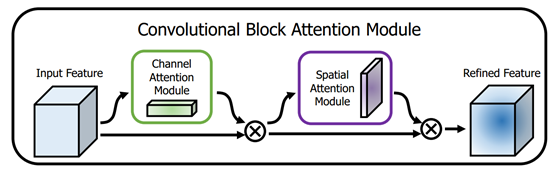

# 第六周 基于卷积的注意力机制

[课程链接](https://oucaigroup.feishu.cn/wiki/SptswYofyi8PhokQNVUcF3WunTz)

## 基本概念

### 1. SENet《Squeeze-and-Excitation Networks》

SENet网络中的“Squeezeand-Excitation”（SE）模块，通过显式地建模通道之间的相互依赖关系，自适应地重新校准通道式的特征响应。其结构如下：

Inception 架构：Inception架构最具标志性的贡献是引入了创新性的"Inception模块"，该模块同时采用多种尺度的卷积和池化操作，并将其输出在通道维度上拼接。这种并行结构使网络能够同时学习不同尺度的特征，从而更好地适应复杂场景下的视觉识别任务。下图是一个inception卷积块的例子：

下图是inception架构：

从图中可以看出，进行 $3 \times 3$ 卷积或 $5 \times 5$ 卷积前，需要先用 $1 \times 1$ 卷积进行降维，这是为了降低计算量。

SENet网络将SE模块集成到Inception中，其结构如下图所示：

### 2. Non-Local Neural Networks

非局部神经网络（Non-local Neural Networks）通过非局部操作捕捉长距离依赖关系，其核心思想是在计算某一位置的特征响应时，不仅仅依赖于局部邻域，而是参考整个特征图上的所有位置。通过这种方式，非局部操作能够有效捕捉全局信息，从而提升模型在视频分类、物体检测、分割和姿态估计等任务中的性能。

Non-local核心组件结构如下：

X是一个feature map,形状为[bs, c, h, w],  经过三个 1 × 1 卷积核，将通道缩减为原来一半（c/2）。然后将h ,w两个维度进行展开(flatten)，变为 h × w ，最终形状为[bs, c/2, h × w]的tensor。对θ对应的tensor进行通道重排，在线性代数中也就是转置，得到形状为[bs, h × w, c/2]。然后与φ代表的tensor进行矩阵乘法，得到一个形状为[bs, h×w，h×w]的矩阵，这个矩阵计算的是相似度（或者理解为attention）。然后经过softmax进行归一化，然后将该得到的矩阵与 g 经过flatten和转置的结果进行矩阵相乘，得到的形状为[bs, h * w, c/2]的结果 y 。然后转置为[bs, c/2, h×w]的tensor, 然后将h×w维度重新伸展为[h, w]，从而得到了形状为[bs, c/2, h, w]的tensor。然后对这个tensor再使用一个1×1卷积核，将通道扩展为原来的c，这样得到了[bs, c, h, w]的tensor,与初始X的形状是一致的。最终一步操作是将X与得到的tensor进行相加(类似resnet中的residual block)。

### 3. CBAM

CNN架构同时对特征图的空间和通道信息进行处理，缺乏显式建模特征空间和通道位置重要性的机制。CBAM也是一种能够集成到任何卷积神经网络架构中的注意力模块。它的核心目标是通过学习的方式，自动获取特征图在通道和空间维度上的重要性，进而对特征图进行自适应调整，增强重要特征，抑制不重要特征，提升模型的特征表达能力和性能。

下图为整个CBAM的示意图，先是通过注意力机制模块，然后是空间注意力模块，对于两个模块先后顺序对模型性能的影响，本文作者也给出了实验的数据对比，先通道再空间要比先空间再通道以及通道和空间注意力模块并行的方式效果要略胜一筹。

### 4. DANet

DANet（Dual Attention Networks）是深度学习领域的一种创新网络结构，于2019年在CVPR上被提出。它通过引入位置注意力模块和通道注意力模块，实现了对图像局部特征和全局依赖的自适应整合，从而显著提升了模型在图像分类、目标检测、语义分割等计算机视觉任务中的性能。

CBAM的位置注意力模块和通道注意力模块是串行运行，而DANet则将位置注意力模块和通道注意力模块进行并行运行。以下是网络结构图：

